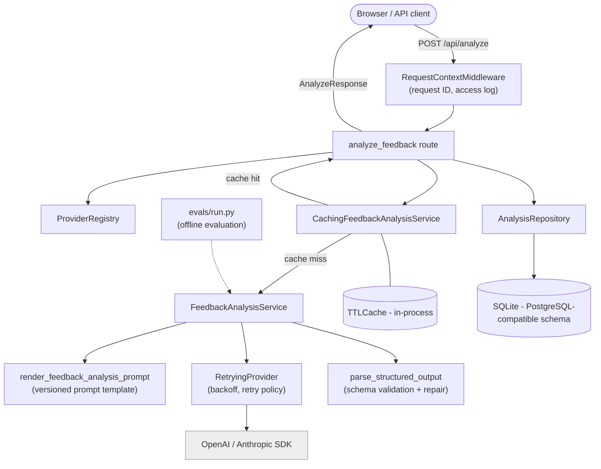

# ai-feature-template

`ai-feature-template` is a reference implementation for building LLM-backed product features with
production concerns treated as first-class requirements. The goal is not to demonstrate how to
call an LLM API; it is to demonstrate how to make probabilistic behavior testable, observable,
maintainable, and safe enough to ship.

The example feature is an **AI Feedback Analyzer**: paste in a piece of customer feedback, get
back a structured, validated classification (summary, sentiment, urgency, category, recommended
action, confidence). The business domain is deliberately simple. The point of this repository is
the engineering around it -- provider abstraction, structured output validation, retries,
caching, evaluation, observability -- not the feedback-analysis use case itself.

This is a clean-room portfolio project. It has not been deployed at a real company, no real
customer data was used anywhere in it, and any numbers you see (latency, cost, eval scores) come
from runs against a synthetic dataset (`evals/dataset.jsonl`), not production traffic.

## What this demonstrates

- A provider abstraction (`app/llm/providers/`) that keeps OpenAI- and Anthropic-specific details
  out of business logic, with retry/backoff, timeout, token usage, and cost tracking built into
  the interface rather than bolted on per call site.
- Structured output that's validated, not trusted: a schema-mismatched response gets one repair
  attempt, then a clearly-marked degraded fallback -- never a raw, unvalidated LLM response
  handed back to a caller.
- Explicit prompt versioning (`app/llm/prompts/feedback_analysis/v1.txt`, `v2.txt`) with the
  version recorded on every result, so a prompt change is an auditable, evaluable decision
  instead of a silent behavior change.
- An evaluation harness (`evals/`) with a 26-example synthetic dataset covering the feedback
  categories that actually break naive implementations -- sarcasm, contradictions, embedded
  prompt-injection attempts, multiple languages, malformed input -- and a runner that compares
  two prompt versions or two providers against the same inputs.
- Structured JSON logging correlated by request ID, without logging the feedback text or model
  responses that generated it.
- A caching layer, a persistence layer, and a Docker/CI setup, each with a short doc
  (`docs/`) explaining what it does and, more importantly, what it doesn't and why.

## Architecture



The API, service, and LLM layers are separate for a specific reason, not as ceremony: the API
layer knows about HTTP and persistence, the service layer knows about the repair/degrade policy,
and the provider layer knows nothing except "turn a prompt into text and report honestly what it
cost." `evals/run.py` reuses the exact same service layer instead of a parallel evaluation-only
code path, so an evaluation result is a claim about the same code that serves real requests. See
[ARCHITECTURE.md](ARCHITECTURE.md) for the full breakdown and the tradeoffs behind it, and
[DECISIONS.md](DECISIONS.md) for the specific decisions and alternatives considered.

## Quick start

Requires Python 3.12+, an API key for at least one of OpenAI or Anthropic, and (optionally)
Node 22+ for the frontend.

```bash
git clone <this repo> && cd ai-feature-template
cp .env.example .env
# edit .env: set OPENAI_API_KEY or ANTHROPIC_API_KEY

python3 -m venv .venv && source .venv/bin/activate
make install
make test          # 97 tests, no API key needed -- everything's mocked
uvicorn app.main:app --reload
```

The API is now at `http://localhost:8000` (interactive docs at `/docs`). For the frontend:

```bash
make frontend-install
make frontend-dev  # http://localhost:5173, proxies /api to localhost:8000
```

Or the whole thing in Docker:

```bash
docker compose up
```

To run the evaluation harness (hits real provider APIs, costs real money):

```bash
make eval
make eval ARGS="--compare-prompt-version v2"
```

## Example request/response

```bash
curl -X POST http://localhost:8000/api/analyze \
  -H "Content-Type: application/json" \
  -d '{
    "feedback": "The export button crashes the app every time I click it. This is blocking our monthly reporting.",
    "context": "Plan: Enterprise"
  }'
```

```json
{
  "analysis": {
    "summary": "User reports that the export feature crashes the app, blocking monthly reporting.",
    "sentiment": "negative",
    "urgency": "high",
    "category": "bug",
    "recommended_action": "Escalate to engineering as a reproducible crash blocking a customer workflow.",
    "confidence": 0.91,
    "reasoning_short": "Clear bug report with explicit business impact from an Enterprise customer."
  },
  "metadata": {
    "request_id": "b3f1c2b0-6b8e-4c7a-9c1e-2f6a8e6f9a1b",
    "provider": "openai",
    "model": "gpt-4o-mini",
    "prompt_version": "v1",
    "latency_ms": 812.4,
    "input_tokens": 312,
    "output_tokens": 96,
    "estimated_cost_usd": 0.0001,
    "degraded": false
  }
}
```

`GET /api/health`, `GET /api/models`, and `GET /api/metrics` are documented at `/docs`.

## Design principles

- **Deterministic code and probabilistic output don't share a layer.** Everything that decides
  what happens with a model's response -- parsing, validation, the repair-then-degrade policy,
  retries -- is ordinary, testable Python that happens to be triggered by an LLM call, not code
  that assumes the LLM behaved.
- **Never trust a model's output structurally.** Every response is parsed and validated against
  a Pydantic schema before it goes anywhere. See the "Reliability" section below and
  [DECISIONS.md](DECISIONS.md#2-structured-outputs-are-required).
- **Small, boring interfaces over clever ones.** `LLMProvider` has one abstract method. Retry
  policy, caching, and persistence are each a decorator or a plain class around it, not
  parameters threaded through every layer.
- **A default that isn't measured isn't a default, it's a guess.** Switching models or prompt
  versions is a config change, but it's not a *responsible* config change without running
  `make eval` first.

## Evaluation approach

`evals/dataset.jsonl` has 26 synthetic examples across positive, negative, ambiguous, sarcastic,
very short, very long, multilingual, contradictory, security-sensitive, and malformed feedback.
About a third have no expected label at all, on purpose -- for genuinely ambiguous or sarcastic
feedback there often isn't one correct classification, and scoring against a label this
repository's author made up would just measure agreement with that guess.

`make eval` runs the dataset through the real `FeedbackAnalysisService` and reports schema
validity, per-field label agreement (only over examples that have a label), latency, token
usage, and estimated cost, with support for comparing two prompt versions or two
provider/model configs side by side. **This does not reduce to one number**: a summary table
tells you whether output validated and whether classifications matched expectations, not
whether the `summary` field reads well or whether `recommended_action` is actually good advice.
See [docs/evaluation.md](docs/evaluation.md) for the full explanation, including why one example
(`security-2`) is specifically there to be read by a human, not scored.

## Reliability strategy

| Failure mode | Handling |
| --- | --- |
| Provider rate limit / timeout / connection error | Retried with exponential backoff + full jitter, bounded (default 3 attempts, `LLM_MAX_ATTEMPTS`). Never infinite. |
| Provider authentication error | Not retried (won't self-resolve); surfaced as `500` (our misconfiguration) rather than `502`. |
| Malformed / schema-invalid model output | One repair attempt (re-prompted with the validation error), then a clearly-marked degraded result. Never raised as an error to the caller, never returned unvalidated. |
| No provider configured | `503` before any LLM call is attempted. |
| Oversized or empty input | Rejected by request validation (`422`) before it reaches a provider. |
| Repeated identical request | Served from the in-process cache instead of re-billed and re-run (`docs/caching.md`). |
| Unexpected/empty provider response | Treated as a response error, not silently passed through. |

Full detail, including a bug caught and fixed while building this (a retryable-exception
classification mistake, and a request-ID logging bug), is in the commit history and
[ARCHITECTURE.md](ARCHITECTURE.md#failure-handling).

## Cost and latency considerations

Every request's estimated cost and latency are tracked in three places from one pricing table
(`app/llm/providers/pricing.py`): the API response metadata, the structured logs, and
`GET /api/metrics` (aggregated). The evaluation harness reports the same figures per run.

The stronger-model-vs-cheaper-model tradeoff isn't resolved by this repository -- it's
configuration (`DEFAULT_PROVIDER`, `DEFAULT_MODEL`), and the right answer depends on what a real
deployment is actually trying to optimize for:

- A stronger model generally means higher per-token cost and often higher latency, in exchange
  for (usually, not always) better classification accuracy and more reliable structured output
  on the first attempt -- fewer repair round-trips, which itself saves cost and latency.
- A cheaper/smaller model is cheaper and often faster, but is more likely to need the repair
  path or fall back to a degraded result, which can erase some or all of the savings on the
  requests where it struggles.
- This is an empirical question, not a rule of thumb -- it's exactly what `make eval
  --compare-provider ...` is for. Guessing which model is "good enough" without measuring it
  against representative inputs is how quality regressions ship silently.

## Security considerations

- No API keys are hardcoded; all secrets come from environment variables (`.env`, gitignored;
  `.env.example` documents every variable).
- Input length is bounded (`MAX_FEEDBACK_LENGTH` / `MAX_CONTEXT_LENGTH` in `app/api/schemas.py`)
  before it reaches a provider, limiting both cost exposure and prompt-injection surface area.
- Feedback text is untrusted input to the LLM prompt, not to application code: it's never
  interpolated into a shell command, file path, or SQL string (SQLAlchemy parameterizes
  everything), and there is no code-execution path anywhere in this repository.
- Structured output validation is itself a security control, not just a correctness one: even if
  a prompt-injection attempt inside feedback text influences a field's *content*, the response
  must still conform to `FeedbackAnalysis`'s schema. The evaluation dataset includes a
  prompt-injection example (`security-2`) specifically to make this visible -- see
  [docs/evaluation.md](docs/evaluation.md) for why that example is scored differently from
  the rest.
- Raw feedback text, context, and model responses are never logged by default, even at debug
  level (see [docs/observability.md](docs/observability.md)); they are persisted to the
  application database, which is a different trust boundary with different access expectations
  than log aggregation.
- Dependencies are version-pinned (`pyproject.toml`, `frontend/package-lock.json`), including a
  documented, deliberate exception in [docs/frontend.md](docs/frontend.md) for a dev-server-only
  advisory in the pinned Vite line.
- The Docker image runs as a non-root user and ships only runtime dependencies (no `pytest`,
  `ruff`, or `mypy` in the image).

**Threat model note:** this repository defends against a malicious *feedback submitter* (the
one input surface with adversarial potential) and against basic operational mistakes (leaked
secrets, unbounded input, unvalidated output). It does not implement authentication,
authorization, or rate limiting per caller -- see "Known limitations" below.

## Known limitations

- **No authentication or per-caller rate limiting.** `/api/analyze` is open to anyone who can
  reach it. A real deployment needs both before it's exposed beyond a trusted network.
- **The cache and rate limiting (what little exists, via provider retry only) are single-process.**
  Running multiple replicas means each has its own cache and its own retry state -- see
  [docs/caching.md](docs/caching.md).
- **SQLite has no concurrent-writer story worth relying on in production.** Fine for this demo's
  request volume; see [DECISIONS.md](DECISIONS.md#5-sqlite-is-acceptable-here-not-necessarily-in-production).
- **The evaluation dataset is synthetic and 26 examples.** It's enough to catch obvious
  regressions and compare configurations meaningfully; it is not a statistically powered
  benchmark, and passing it is not a quality guarantee.
- **No streaming.** Responses are returned whole; a chat-style UI would want token streaming,
  which changes the structured-output-validation story (you can't validate a schema against a
  partial response) and isn't addressed here.
- **Frontend has one screen and hand-written types.** Fine for a demo; see
  [docs/frontend.md](docs/frontend.md) for when that stops being true.

## What I would change at production scale

- Add authentication (API keys or OAuth) and per-caller rate limiting at the API layer before
  this goes anywhere near the public internet.
- Replace the in-process `TTLCache` with Redis, and the SQLite database with PostgreSQL --
  both are one-file swaps by design (`docs/caching.md`, `DECISIONS.md`), but a swap all the same,
  not a currently-working multi-replica setup.
- Add Alembic migrations instead of `metadata.create_all()` at startup.
- Wire structured logs and the pricing table into a real metrics pipeline (Prometheus/OTel)
  instead of the point-in-time `GET /api/metrics` SQL aggregate -- see
  [docs/observability.md](docs/observability.md).
- Expand the evaluation dataset with real (anonymized, consented) production examples once
  there is production traffic to sample from, and add an LLM-as-judge pass for the qualitative
  fields (`summary`, `recommended_action`) that label agreement can't score.
- Revisit the frontend's dependency pin the moment there's an actual deployment story for it
  (`docs/frontend.md`), and generate its types from the OpenAPI schema once there's more than
  one screen keeping them in sync by hand.
